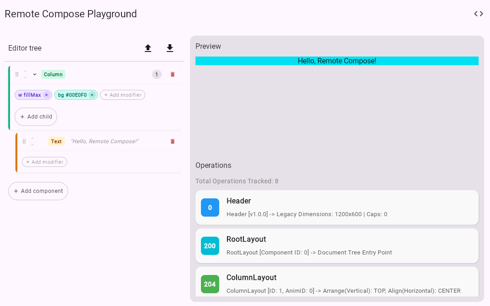

# Remote Compose Player - Compose Multiplatform

An unofficial Kotlin Multiplatform (KMP) + Compose Multiplatform (CMP) Remote Compose player that works across Android, iOS, Web, and Desktop targets.

## Overview
Render Remote Compose documents generated by the creation libraries on KMP+CMP targets. 

For maximum compatibility, generate the Remote Compose document (ByteArray) using the following version: `androidx.compose.remote:remote-*:1.0.0-alpha11`.

Try out the WASM build of the sample app at https://deanalvero.github.io/remotecomposeplayer-cmp/.



## Dependency
Add the dependency to your build.gradle. Replace version with what is available [here](https://central.sonatype.com/artifact/io.github.deanalvero/remotecomposeplayer/versions).
```
implementation("io.github.deanalvero:remotecomposeplayer:<version>")
```

## Usage
```
val bytes: ByteArray = ... // read from .rc file or from other sources
RemoteComposePlayer(
    rcBytes = bytes
)
```

## Supported operations
- See the classes in the package: `io.github.deanalvero.remotecomposeplayer.operation`
- (more to be added)

## Notes
Enjoy!