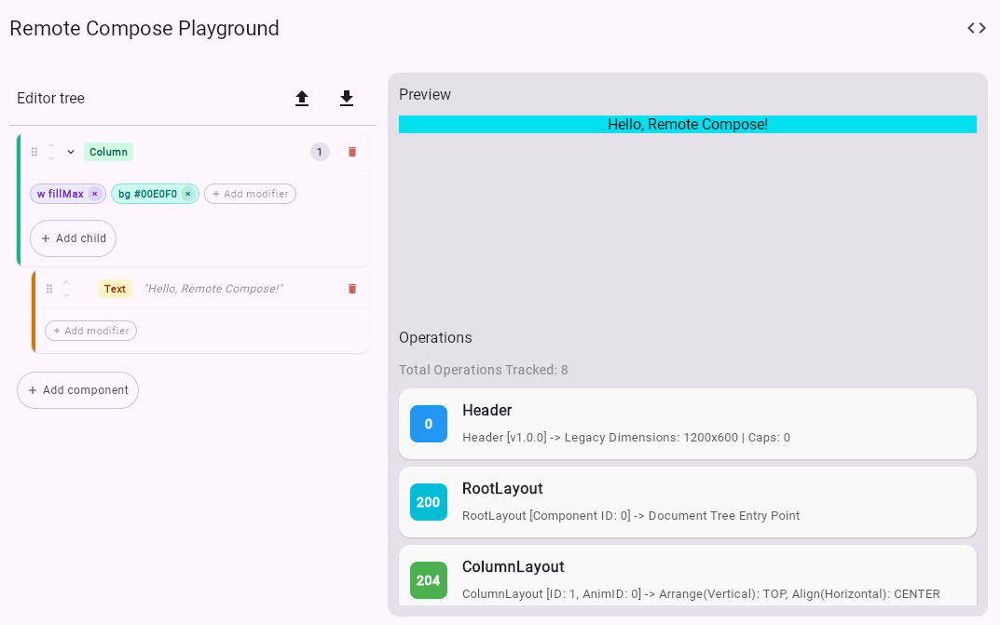

# KMP/CMP Remote Compose Player

A Kotlin Multiplatform (KMP) + Compose Multiplatform (CMP) Remote Compose player that works across Android, iOS, Web, and Desktop targets.

## Overview
Render Remote Compose documents generated by the creation libraries on KMP+CMP targets. 

For maximum compatibility, generate the Remote Compose document (ByteArray) using the following version: `androidx.compose.remote:remote-*:1.0.0-alpha13`.

The sample app has a list of Remote Compose examples and shows the creator code, operations list, and a KMP/CMP preview for each example. It also includes a Remote Compose Playground to test out the different components, modifiers, and other operations. The WASM build of the sample app is hosted as a GitHub Page in this repo: https://deanalvero.github.io/remotecomposeplayer-cmp/

[](https://deanalvero.github.io/remotecomposeplayer-cmp/)

## Dependency
Add the dependency to your build.gradle. Replace version with what is available [here](https://central.sonatype.com/artifact/io.github.deanalvero/remotecomposeplayer/versions).
```
implementation("io.github.deanalvero:remotecomposeplayer:<version>")
```

## Usage
### Player side
```
import io.github.deanalvero.remotecomposeplayer.RemoteComposePlayer

val bytes: ByteArray = ... // read from .rc file or from other sources
RemoteComposePlayer(
    rcBytes = bytes
)
```

### Creator side
The ByteArray can be generated from either an Android device or a JVM backend using the official Remote Compose creator libraries.

If you want to see how to set up a JVM server, check out the [sample/server](./sample/server) folder which contains a Ktor-based backend using the Remote Compose DSL.

## Supported operations
See the classes in the package: [io.github.deanalvero.remotecomposeplayer.operation](./remotecomposeplayer/src/commonMain/kotlin/io/github/deanalvero/remotecomposeplayer/operation)

## Notes
Enjoy!
